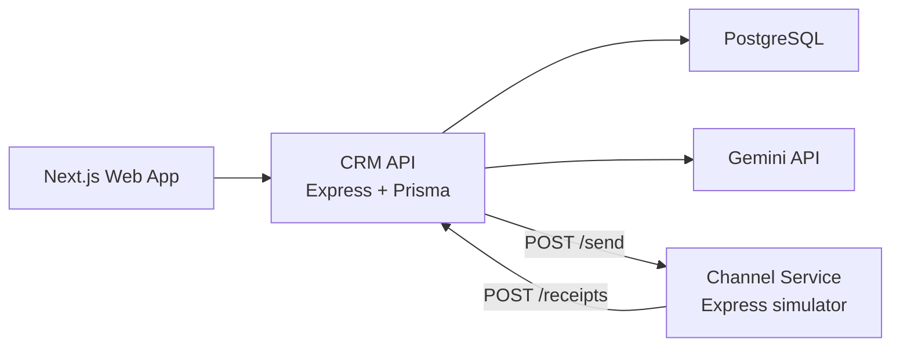

# SmartCRM — Xeno Mini CRM

SmartCRM is an AI-native mini CRM for D2C fashion shopper engagement. It helps a marketer ingest shopper data, build audiences, draft personalized campaigns, send them through a separate channel simulator, and understand performance through event-log analytics.

## What Is Built

- Customer and order CRUD APIs backed by PostgreSQL and Prisma.
- Bulk CSV ingestion with row-level validation and error reporting.
- Fashion seed data with 151 Gmail-based demo customers and 459 orders.
- Rule-based segmentation plus AI natural-language-to-rules generation.
- Campaign wizard with AI message variants and human edit/approval.
- Separate Express channel service with asynchronous receipt callbacks.
- Campaign, segment, and global insights dashboards using delivery event logs.
- AI campaign retrospectives grounded in real aggregate stats.
- Advanced growth intelligence: health score, next-best actions, and smart audience opportunities from customer/order/campaign signals.

## Architecture



More detail:

- `docs/ARCHITECTURE.md`
- `docs/TRADEOFFS.md`
- `docs/DEPLOYMENT_CHECKLIST.md`

## Local Setup

```bash
cp .env.example .env
npm install
docker compose up -d
npm run prisma:migrate
npm run seed:csv
npm run dev
```

Local URLs:

- Web: `http://localhost:3000`
- CRM API: `http://localhost:4000`
- Channel service: `http://localhost:4001`

## Validation

```bash
npm run typecheck
npm run build
```

The root scripts validate all workspaces: shared types, CRM API, channel service, and web app.

## CSV Seed Data

Run:

```bash
npm run seed:csv
```

This generates:

- `data/customers.csv`
- `data/orders.csv`

CSV import accepts either `text/csv` request bodies or JSON bodies shaped as `{ "csv": "..." }`.

## Key API Routes

- `GET /health`
- `GET /customers`
- `POST /import/customers`
- `POST /import/orders`
- `GET /segments`
- `POST /segments/preview`
- `POST /segments/ai-generate`
- `GET /segments/:id/stats`
- `GET /campaigns`
- `POST /campaigns`
- `POST /campaigns/:id/ai-draft`
- `POST /campaigns/:id/send`
- `GET /campaigns/:id/stats`
- `GET /campaigns/:id/insight`
- `POST /receipts`
- `GET /insights`

## Phase 4 Insights

- Stats are computed from `communications` plus immutable `communication_events`.
- `/insights` compares channels, segments, recent campaigns, and attributed revenue.
- `/insights` also surfaces an executive decision brief, growth health score, and prioritized revenue plays.
- Campaign detail pages show sent/delivered/opened/clicked/failed/bounced funnel data.
- Segment detail pages aggregate campaign performance for each audience.
- Attribution is intentionally scoped as completed orders within 48 hours after a click.
- AI retrospectives receive compact JSON stats and return summaries, recommendations, and caveats.

## Deployment Notes

- Use Vercel for the Next.js app with `NEXT_PUBLIC_API_URL`.
- Use Render/Railway for the CRM API and channel service.
- Use Supabase Postgres for the hosted database by setting `DATABASE_URL` and `DIRECT_URL` on the API service.
- Set `CORS_ORIGIN` to the deployed frontend URL.
- Set `CHANNEL_SERVICE_URL` to the deployed channel service URL.
- Set `CRM_CALLBACK_URL` to the deployed CRM API URL.
- Follow `docs/SUPABASE_VERCEL_RENDER_SETUP.md` for the exact deployment order and env mapping.
- Verify the full public send-to-receipt-to-insights loop before recording.

## Tradeoffs

- The channel service uses in-process timers for the assignment; production would use a durable queue.
- Current aggregation is Prisma/Postgres driven; production scale would add rollups or materialized views.
- AI assists at key workflow points but never hides the underlying rules or metrics.
