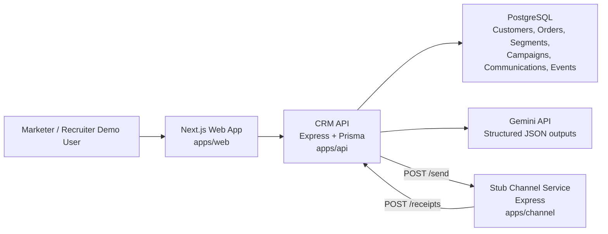

# SmartCRM Architecture

SmartCRM is a three-app monorepo that models the core Xeno assignment loop: ingest shoppers, segment them, send personalized campaigns through a separate channel service, receive asynchronous receipts, and surface performance insights.

## Runtime Responsibilities

- `apps/web`: product UI for import, customers, orders, segments, campaigns, and insights.
- `apps/api`: source-of-truth CRM API, segment evaluation, campaign sending, receipt ingestion, AI calls, and aggregation.
- `apps/channel`: independent delivery simulator that returns `202` immediately and later calls the CRM receipt webhook.
- `packages/shared`: Zod schemas and TypeScript response contracts shared by API and web.
- `data`: demo-ready CSVs with Gmail-style customer emails and fashion purchase history.

## Critical Flow

1. Marketer creates a segment manually or via AI-generated rules.
2. Marketer creates a campaign, optionally using AI message variants.
3. CRM resolves segment customers and creates `Communication` rows.
4. CRM calls the channel service with recipient/message payloads.
5. Channel service simulates delivery lifecycle events asynchronously.
6. CRM receives idempotent receipts and appends `CommunicationEvent` rows.
7. Insights dashboard aggregates event-log data and AI summarizes campaign performance.
8. Growth intelligence scores the CRM health and identifies next-best revenue plays from customer/order/campaign signals.

## Why Event Logs

The current `Communication.status` is denormalized for fast list views, while `CommunicationEvent` preserves the lifecycle history. This makes the dashboard explainable: delivery/open/click rates are derived from callback events rather than front-end-only counters.

## Scale Notes

- Assignment scale: hundreds to thousands of communications, simple Prisma aggregation is acceptable.
- Production scale: replace in-memory channel delays with BullMQ/Upstash/SQS, add retry/backoff receipt delivery, and move hot dashboard metrics to rollups or materialized views.
